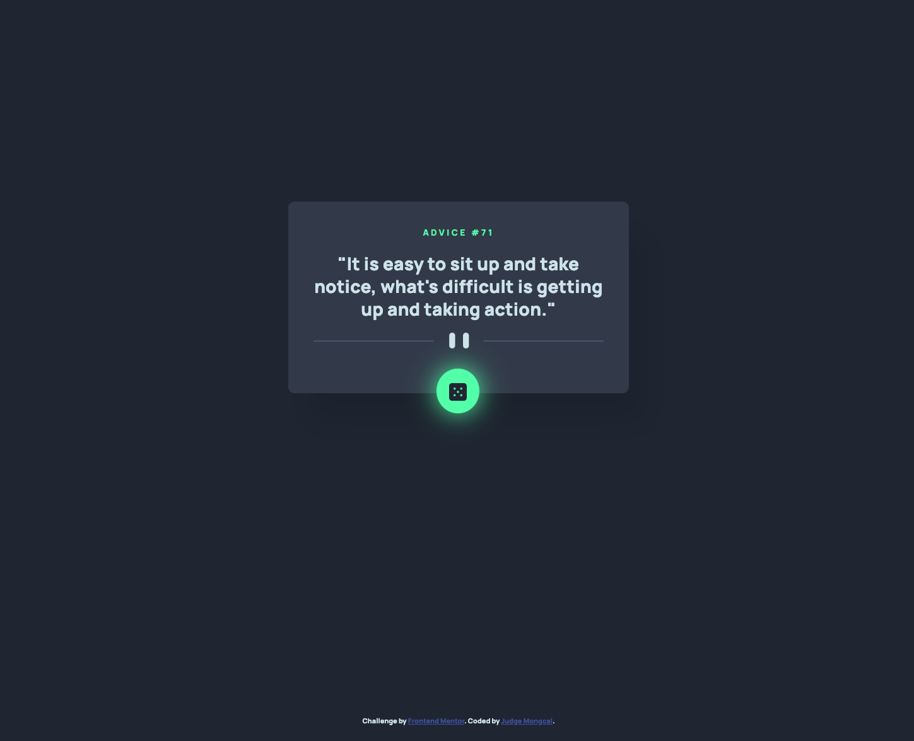

# advice-generator-app
 An advice generator made with HTML, CSS, and Vanilla JS.

## Table of contents

- [Overview](#overview)
  - [The challenge](#the-challenge)
  - [Screenshot](#screenshot)
  - [Links](#links)
- [My process](#my-process)
  - [Built with](#built-with)
- [Author](#author)

## Overview

This is a Frontend Mentor challenge wherein I have to use an API to generate a random advice whenever a button is clicked. This is my first project after going through Brad Traversy's Modern JS Course 2023 where I learned about the fundamentals of JS. 

### The challenge

Users should be able to:

- View the optimal layout for the app depending on their device's screen size
- See hover states for all interactive elements on the page
- Generate a new piece of advice by clicking the dice icon

### Screenshot

 

### Links

- Solution URL: [https://github.com/judgemongcal/advice-generator-app]
- Live Site URL: [https://joyful-smakager-793b7c.netlify.app/]

## My process

My process started with coding all the HTML elements necessary for this project one by one, and styling them with CSS to allow myself to focus on completing one area of the design before I move on with the next one (divide and conquer approach). I always take a mobile-first approach when dealing with the CSS and adding media queries whenever I see fit. Then, I coded the JS functionalities (Fetch API) to make sure that a new advice is generated whenever the user clicks the dice.

### Built with

- CSS custom properties
- Flexbox
- Mobile-first workflow
- Responsive Design
- Vanilla JS 

## Author

- LinkedIn - [@judgemongcal](https://www.linkedin.com/in/judgemongcal/)
- Frontend Mentor - [@judgemongcal](https://www.frontendmentor.io/profile/judgemongcal)